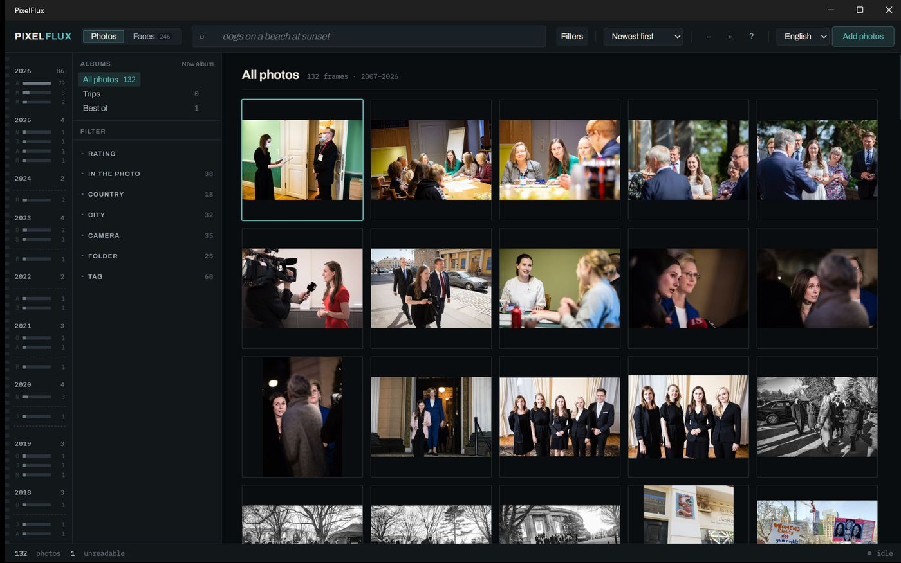
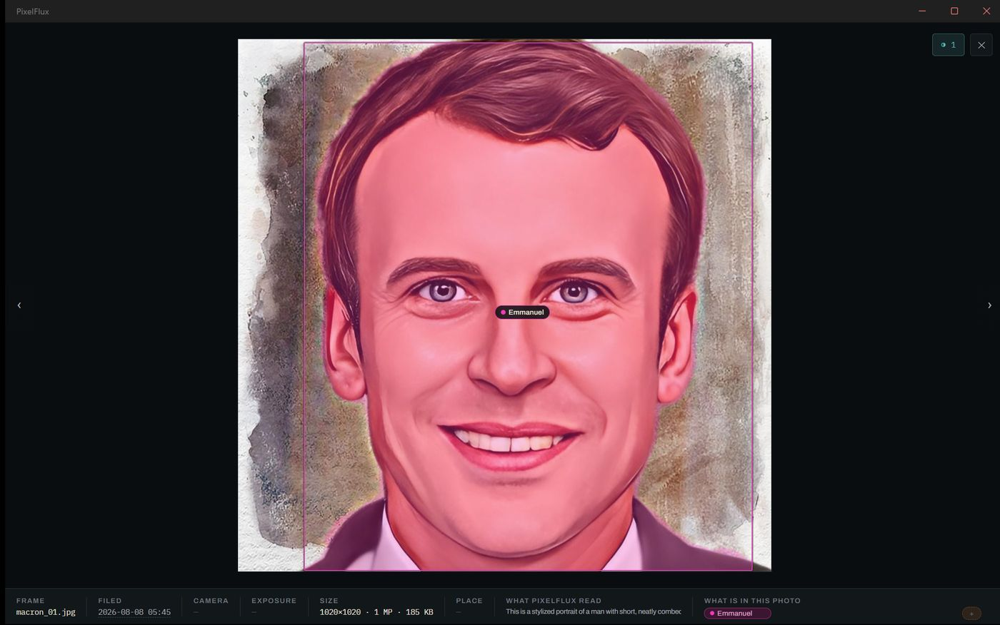

# PixelFlux

**Search your photographs by what is in them, on a laptop, with nothing leaving the machine.**



Type `red car` and you get the red car — not the file called `car.jpg`, and not a cloud service's
answer. A vision model has already looked at every photograph and written a paragraph about it, a
segmenter has outlined what is in it, a detector has found the faces, and all of that has been
folded into one searchable vector. On your machine.

The one exception is honest and up front: the models are too large to ship and not ours to
redistribute, so on first run PixelFlux offers to download them. That is the only time it touches
the network, it happens because you pressed a button, and nothing else does — browsing, analysis
and search make no requests at all, and the interface's content security policy forbids them.

Windows desktop, .NET 10, MAUI Blazor Hybrid, built and measured on a Snapdragon X2 (arm64).

---

## The bet

Small local models are now good enough that a photo library does not need a server to be
searchable by meaning — but only if you are willing to spend the compute *once*, offline, and
engineer around the fact that each individual model is mediocre.

That is the whole design. A 2-billion-parameter vision model is not GPT-4; it takes eleven seconds
a photograph and it will occasionally invent a sign that is not there. An image encoder knows a car
from a boardroom and cannot reliably tell red from blue. Neither is good enough alone. Together,
run patiently overnight and cached forever, they make a library you can actually ask questions of.

## What that looks like

This is a real description, generated locally in about eleven seconds:

> In the sunlit foreground of this urban scene, a black mountain bike with gold-tipped wheels
> stands propped against a weathered black trash can. […] Behind the bike, a vibrant wall of
> graffiti in shades of green, pink, and yellow stretches across the background. […] The ground is
> marked with yellow lines, possibly from a road or bike path.

And a real search, over 132 photographs where nothing is tagged `red`:

```
$ pixelflux vsearch "red car"
  0.111  z+4.83  008_car_1954-sunbeam-talbot-alpine-sports-roadster…
  0.088  z+3.93  006_car_malta-classic-car-museum…
  0.077  z+3.52  009_car_hk-mk-mongkok-555-shanghai-street…
```

The top hit is the red roadster. Before the descriptions were folded into the vector, it was not.



## Things that turned out to be true

Most of this project's interesting decisions came from a measurement contradicting the obvious
guess. The comments in the code record them; here are the ones that shaped the design.

**A caption in the search vector is worth more than a better image encoder.** Blending the CLIP
text embedding of the generated description with the image embedding, at 80/20 in the image's
favour, takes `red car` from 0.80 to 1.00 precision-at-five. Both extremes lose: captions alone
miss what the picture obviously shows, images alone miss the adjective. The weight is part of the
model version string, because otherwise changing it silently reuses the old vectors — which
happened, and looked exactly like the change having no effect.

**A repetition penalty trades looping for hallucination, and that is the wrong trade.** Greedy
decoding loops at the tail of a description. Adding a penalty stops it — and starts inventing: at
1.15 the model produced a "SCHULTE" sign, a box labelled "102" and a name tag reading "M.", all
new specific strings with no more of the photograph behind them. For text that becomes a search
index, a repeated sentence is harmless noise and an invented proper noun makes a photo findable by
a word that is not in it. So the decoder stops on a repeated sentence instead.

**The bottleneck was never the model.** Face detection cost 114 ms a photograph, of which the
network was under 10 ms; the rest was decoding a 4-megapixel JPEG twice and throwing most of it
away. Decoding at the size the model actually wants — JPEG can rescale by halves almost free —
took the face stage from 82 s to 25 s over the library. It costs 0.8% of detections, which is
measured and written down rather than glossed.

**A graphics processor is not uniformly faster.** DirectML makes YuNet and SFace about twice as
quick and YOLO and CLIP about twice as slow, because operator coverage decides it and every node
handed back to the processor costs a bus round trip. So the preference is per model. It is also
worth nothing at all until the decode cost above is fixed — the same benchmark showed 0% and then
15% before and after, with no change to the accelerator.

## The analysis queue

Reading a library takes hours, so it is a queue rather than a button.

Four stages run in a fixed order — **describe → segment → faces → embed** — because the search
vector reads the description, so the description must exist first. Work goes stage-first across the
whole library, not photograph-first, so a part-analysed collection is shallow everywhere rather
than perfect on nine photographs and untouched on nine hundred.

It runs one photograph at a time with a pause between them, on a schedule you set: while the app is
open, overnight between two times, or only when you ask. Results are cached against the image's
content hash, so **an analysis outlives the row that held it** — delete a photograph and re-import
it, or rebuild the index, and the work comes back rather than being redone.

Everything degrades on its own. No vision model means no descriptions and everything else still
runs; no face model means no faces page and nothing else changes.

## Faces, and who they are

Faces are detected, cropped and embedded, so "show me everyone who looks like this" works without
anyone naming anybody. Name one and it sticks — including across a re-sweep, where every face row
is replaced and the name is re-matched by overlap. The threshold for that is deliberately high:
losing a name is an annoyance, and putting the wrong name on somebody is a library that quietly
lies about who is in a picture.

A named face also resolves the segmenter's anonymous `person` outline to that name, which is two
models that have never heard of each other being reconciled by arithmetic on two rectangles.

## Getting started

```
git clone <this repo>
cd PixelFlux
dotnet build
dotnet run --project src/PixelFlux.App
```

You now have a working library — import, browse, albums, ratings, filters, full-text search. Every
intelligent feature is off until you supply the models, and says so rather than failing.

**Models** are not included: they are about two gigabytes and none is ours to redistribute. See
[docs/MODELS.md](docs/MODELS.md) for each one, where to get it, and what its licence permits.

**The test corpus** is not included either — 132 Wikimedia Commons photographs, rebuilt with
`python tools/fetch_test_album.py` and `tools/fetch_people_set.py`. Both write an
`ATTRIBUTION.tsv` naming every photographer, and those files *are* committed, so the provenance is
here even when the images are not.

**Optional acceleration:** `python tools/fetch_runtime.py` extracts an ONNX Runtime build with
execution providers compiled in — the stock NuGet package has none at all. `pixelflux accel` then
reports what your machine can target.

## Command line

`tools/PixelFlux.Cli` drives a library without the window. Most of this project was measured
through it.

```
pixelflux import <folder>...     index every image beneath these folders
pixelflux find "a dog"           words and meaning, blended
pixelflux pipeline status        what each stage has left to do
pixelflux pipeline run           work the queue in order
pixelflux describe --profile     where the time actually goes, per photograph
pixelflux name <face-id> <name>  say who somebody is
pixelflux accel                  what hardware the models can run on
```

`pixelflux --help` lists the rest. Libraries live in `%LOCALAPPDATA%\PixelFlux`, or wherever
`PIXELFLUX_HOME` points.

## Layout

| Project | What lives there |
| --- | --- |
| `PixelFlux.Core` | Domain model, SQLite index and migrations, ingestion, search, the analysis queue |
| `PixelFlux.Ai` | Model wrappers, stage handlers, the compute backend |
| `PixelFlux.Storage` | Object storage behind an interface — filesystem today, S3 if wanted |
| `PixelFlux.App` | The MAUI Blazor Hybrid application |
| `PixelFlux.Cli` | Headless driver |
| `PixelFlux.Tests` | 207 tests, including real inference against the real models |

Two conventions before reading the code. Comments explain *why*, and often what was tried first —
the ones recording a measurement that overturned the obvious answer are the ones worth reading. And
the migration array is append-only: a shipped entry is never edited, because a device that has
already run it will not run it again.

## Tests

```
dotnet test
```

207 tests. Most are pure logic and run anywhere, but roughly a third do real inference against the
real models, and ten need the photograph corpus. **On a fresh clone those fail rather than skip** —
fetch the corpus and the models first, or filter to the parts that do not need them:

```
dotnet test --filter "FullyQualifiedName~PipelineTests|FullyQualifiedName~PersonSegmentTests|FullyQualifiedName~PeopleTests|FullyQualifiedName~Localisation"
```

Making the model-dependent ones skip cleanly is worth doing and has not been done.

## Honest limitations

- **Windows only.** MAUI Blazor Hybrid, and the acceleration path is DirectML. Nothing is
  conceptually tied to Windows except that, but nothing else has been tried.
- **arm64 is the tested target.** x64 builds and the tests pass; it gets far less use.
- **The vision model is small and sometimes wrong.** It reads signs that are not there often
  enough that descriptions are treated as search material, never as fact shown to you as truth.
- **Face grouping is appearance, not identity.** It is recomputed on every page load and never
  stored. Only names you type are treated as facts.
- **No sync.** Libraries are local. The storage interface has an S3 implementation and the schema
  carries revision numbers, but nothing is wired to them yet.

## Licence

MIT — see [LICENSE](LICENSE).

The models are separately licensed and none is distributed here; the segmentation model is
AGPL-3.0, which is one reason it is fetched rather than shipped. Third-party components and their
terms are listed in [NOTICE.md](NOTICE.md).
